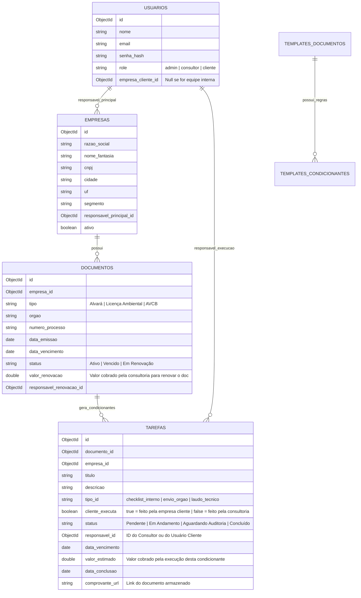

# Modelagem de Banco de Dados MongoDB & Arquitetura de Dados

Para atender a um plano de planejamento de até 15 anos com controle financeiro, previsibilidade de receita e multi-perfis de acesso, utilizaremos o **MongoDB** como banco de dados principal. 

O modelo segue a analogia da **"venda de um carro"**:
1. O **Documento Regulatório** (Licença, Alvará, AVCB) é o "Carro/Produto Principal".
2. As **Condicionantes** são o "Plano de Revisões Programadas" geradas a partir do momento em que o documento é emitido pelo órgão regulador.
3. Cada condicionante tem uma data de vencimento futura, um responsável e um **valor financeiro**.
4. O faturamento mensal previsto é a soma do valor das condicionantes a serem executadas naquele mês + a taxa de renovação do documento (se aplicável).

---

## 1. Diagrama de Relacionamento Lógico (NoSQL)

Abaixo está a estrutura de coleções que utilizaremos. Optamos por **referenciar** as tarefas condicionantes e documentos principais em coleções separadas para permitir consultas de performance extremamente rápidas ao filtrar dados por mês/ano específicos no Dashboard de Previsibilidade, evitando carregar documentos aninhados gigantescos de 15 anos em memória de uma só vez.



---

## 2. Schemas Detalhados do MongoDB

### 2.1 Coleção: `usuarios` (Users)
Armazena a equipe da consultoria e os clientes finais que terão acesso ao módulo "empresa".
```json
{
  "_id": {"$oid": "665f8c8d8f1e2c001f3e7a01"},
  "nome": "Roberto Silva",
  "email": "roberto@consultoria.com.br",
  "senha_hash": "$2b$10$xyz...",
  "role": "consultor", 
  "empresa_cliente_id": null, // Preenchido apenas se role for 'cliente'
  "telefone": "(11) 99999-9999",
  "ativo": true,
  "criado_em": {"$date": "2026-06-03T18:00:00Z"}
}
```

### 2.2 Coleção: `empresas` (Companies)
Os clientes da consultoria.
```json
{
  "_id": {"$oid": "665f8c8d8f1e2c001f3e7a02"},
  "razao_social": "Alpha Alimentos LTDA",
  "nome_fantasia": "Alpha Foods",
  "cnpj": "11.222.333/0001-01",
  "cidade": "São Paulo",
  "uf": "SP",
  "segmento": "Alimentos",
  "responsavel_principal_id": {"$oid": "665f8c8d8f1e2c001f3e7a01"}, // Consultor responsável pela conta
  "ativo": true
}
```

### 2.3 Coleção: `documentos` (Documents)
As licenças vigentes de cada empresa.
```json
{
  "_id": {"$oid": "665f8c8d8f1e2c001f3e7a03"},
  "empresa_id": {"$oid": "665f8c8d8f1e2c001f3e7a02"},
  "tipo": "Alvará / Licença Operacional",
  "orgao": "Prefeitura SP",
  "numero_processo": "2026/00192-00",
  "data_emissao": {"$date": "2026-10-15T00:00:00Z"},
  "data_vencimento": {"$date": "2030-10-15T00:00:00Z"}, // 4 anos de validade
  "status": "Ativo",
  "valor_renovacao": 1500.00, // Preço cobrado no vencimento para renovar
  "responsavel_renovacao_id": {"$oid": "665f8c8d8f1e2c001f3e7a01"}
}
```

### 2.4 Coleção: `tarefas` (Tasks / Condicionantes)
A lista de todas as tarefas associadas a um documento ou recorrentes agendadas no futuro.
```json
{
  "_id": {"$oid": "665f8c8d8f1e2c001f3e7a04"},
  "documento_id": {"$oid": "665f8c8d8f1e2c001f3e7a03"}, // Vinculado à Licença
  "empresa_id": {"$oid": "665f8c8d8f1e2c001f3e7a02"}, // Desnormalizado para busca rápida
  "titulo": "Checklist mensal operacional - Resíduos",
  "descricao": "Vistoria e conferência do armazenamento de resíduos no galpão B.",
  "tipo_id": "checklist_interno",
  "cliente_executa": true, // A própria farmácia/empresa executa
  "status": "Pendente",
  "responsavel_id": {"$oid": "665f8c8d8f1e2c001f3e7a10"}, // ID do usuário do cliente
  "data_vencimento": {"$date": "2026-10-31T23:59:59Z"},
  "valor_estimado": 250.00, // Faturamento gerado por esta condicionante
  "data_conclusao": null,
  "comprovante_url": "",
  "historico_observacoes": [
    {
      "data": {"$date": "2026-06-03T20:00:00Z"},
      "usuario_id": {"$oid": "665f8c8d8f1e2c001f3e7a01"},
      "texto": "Criado automaticamente via cronjob de recorrência do plano de manutenção."
    }
  ]
}
```

### 2.5 Coleção: `templates_documentos` (Templates)
Para cadastrar rapidamente um plano pré-formatado por segmento.
```json
{
  "_id": {"$oid": "665f8c8d8f1e2c001f3e7a05"},
  "segmento": "Alimentos",
  "nome_documento": "Licença Sanitária Municipal",
  "validade_meses_padrao": 12,
  "valor_renovacao_sugerido": 1200.00,
  "condicionantes_sugeridas": [
    {
      "titulo": "Renovação de Laudo de Potabilidade de Água",
      "frequencia_meses": 6,
      "cliente_executa": false,
      "valor_sugerido": 350.00
    },
    {
      "titulo": "Dedetização Periódica",
      "frequencia_meses": 1,
      "cliente_executa": true,
      "valor_sugerido": 0.00
    }
  ]
}
```

---

## 3. Query de Previsibilidade Financeira e Operacional

Para alimentar o dashboard principal, o sistema fará buscas otimizadas pelo mês e ano desejados.

### 3.1 Consulta de Faturamento Previsto (Aggregation no MongoDB)
Para calcular a receita do mês `10` de `2026` (`2026-10-01` a `2026-10-31`), rodamos a seguinte aggregation:

```javascript
db.tarefas.aggregate([
  {
    $match: {
      data_vencimento: {
        $gte: ISODate("2026-10-01T00:00:00Z"),
        $lte: ISODate("2026-10-31T23:59:59Z")
      }
    }
  },
  {
    $group: {
      _id: null,
      faturamento_condicionantes: { $sum: "$valor_estimado" },
      total_tarefas: { $sum: 1 }
    }
  }
])
```
*Em paralelo, fazemos o `match` e `group` na coleção de `documentos` para somar os `valor_renovacao` dos documentos que vencem em `2026-10`.* 
A união desses dois agregados resulta na **Previsibilidade Financeira Total** do mês.

---

## 4. Estratégia de Cronjobs de Notificações e Checklists

1. **Geração Futura de Tarefas (15 Anos):**
   * Ao cadastrar ou renovar um `documento`, o sistema calculará o intervalo de vigência.
   * Se a vigência for de 10 anos (120 meses), e houver uma condicionante trimestral, o sistema gerará em lote **40 tarefas** futuras com datas incrementadas de 3 em 3 meses no banco.
   * Isso possibilita que buscas de 15 anos no futuro funcionem instantaneamente, pois os registros físicos das tarefas futuras já existirão no banco de dados com seus respectivos valores estimados.

2. **Mecanismo de Alertas Ativos:**
   * Um Cronjob rodará diariamente (ex: às 03:00 da manhã) para varrer tarefas que vencem em **30, 15, 7 e 1 dia(s)**.
   * Envia notificações push (Service Workers no PWA) e e-mails tanto para o consultor responsável quanto para o cliente (se for uma tarefa de responsabilidade do cliente).
