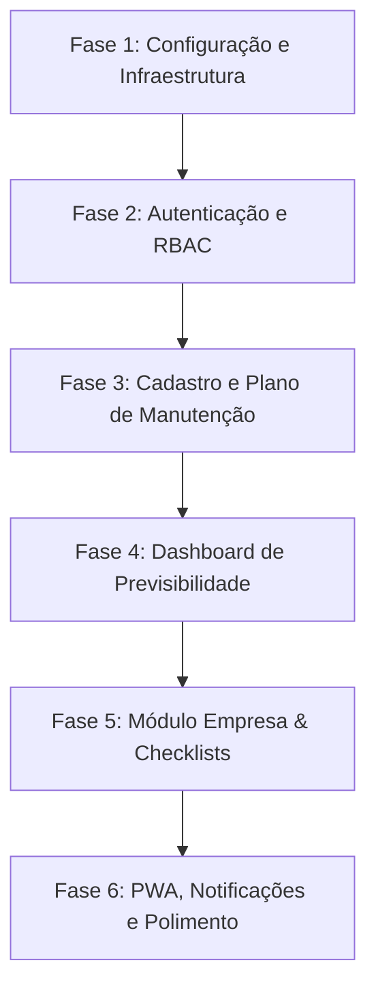

# Plano de Implementação Técnica do Sistema

Este plano orienta o desenvolvimento passo a passo do sistema de gestão regulatória para a consultoria de conformidade. O objetivo é construir uma aplicação de alta performance, segura, focada em previsibilidade financeira e que funcione como um PWA instalado no celular.

---

## 1. Stack Tecnológica Sugerida

Para atender a todos os critérios de modernidade, rapidez, PWA e flexibilidade do MongoDB, utilizaremos a seguinte stack:

* **Frontend:** React + Vite ou Next.js (com TypeScript). Usaremos **Vanilla CSS** bem estruturado (variáveis de design dinâmicas, glassmorphism, suporte nativo a dark mode, animações fluidas) para garantir uma interface premium.
* **Backend:** Node.js (Express ou NestJS) com TypeScript.
* **Banco de Dados:** MongoDB (gerenciado via Mongoose).
* **Notificações:** Web Push API (notificações nativas no navegador) e e-mail via serviço SMTP/SES.
* **Hospedagem & Storage:** Vercel/Render (App/API) e AWS S3 ou Supabase Storage (para guarda segura dos comprovantes e PDFs das licenças).

---

## 2. Fases de Desenvolvimento

### Fase 1: Configuração e Infraestrutura (Semana 1)
* Configuração do repositório monorepo ou separado (Frontend & Backend).
* Inicialização do MongoDB e definição das coleções com seus devidos índices (índices em `tarefas.data_vencimento` e `empresas.cnpj` para buscas otimizadas).
* Configuração do serviço de arquivos (AWS S3 ou similar) para upload dos comprovantes.

### Fase 2: Autenticação e Níveis de Acesso (RBAC) (Semana 1)
* Criação dos fluxos de login e recuperação de senha.
* Implementação do JWT (JSON Web Tokens) com verificação de roles no middleware do Express.
* **Regras de Acesso (Roles):**
  * **Administrador (Dono da Consultoria):** Visualização completa do faturamento geral, relatórios financeiros, cadastro de consultores e clientes, exclusão de dados.
  * **Consultor (Equipe Técnica):** Vê todas as empresas pelas quais é responsável, gerencia tarefas/condicionantes vinculadas a essas empresas e faz uploads de comprovantes. Não vê dados financeiros consolidados de faturamento do dashboard administrativo.
  * **Cliente (Empresa Concessionária):** Vê apenas a sua própria empresa. Acessa calendário de vencimentos, visualiza PDFs das licenças ativas e executa checklists de sua responsabilidade (ex: anexar comprovante de envio de BMPO). Não vê dados de faturamento nem outras empresas.

### Fase 3: Cadastros e o "Plano de Manutenção" (Semana 2)
* Criação da tela de gerenciamento de templates de documentos e condicionantes por setor.
* Módulo de cadastro de Empresas (Clientes).
* **Mecanismo de Ativação do Plano de Manutenção:** Ao adicionar uma nova licença a uma empresa, o consultor define a data de emissão e de vencimento (vigência de até 15 anos). O backend calcula as datas das condicionantes recorrentes e insere os registros das tarefas no banco em lote.
* Upload e vinculação de arquivos PDF das licenças.

### Fase 4: Dashboard de Previsibilidade (Semana 2)
* Construção do gráfico de faturamento programado futuro (linha/barras) mostrando os próximos 12 meses.
* Filtro de busca por mês e ano específicos (ex: Outubro/2026).
* Tabela dinâmica listando as tarefas que vencem no mês filtrado, o responsável pela execução (consultor ou cliente) e o valor associado ao serviço.
* Bloco indicador de Receita Total Estimada para o mês selecionado.

### Fase 5: Calendário e Módulo Empresa (Semana 3)
* Calendário interativo (mensal/semanal) com marcadores coloridos por tipo de status da tarefa (Pendente, Concluído, Em Auditoria, Atrasado).
* Módulo exclusivo do Cliente (Empresa) para responder às tarefas sob sua responsabilidade (ex: farmácias fazendo upload de relatórios sanitários recorrentes).
* Cronjob de recorrência diária para monitorar e expirar status de tarefas que ultrapassaram a data de vencimento sem entrega de comprovante.

### Fase 6: PWA, Notificações e Polimento (Semana 3)
* Configuração do `manifest.json` e do Service Worker para cache local do aplicativo e ícones de instalação rápida em Android e iOS.
* Implementação do fluxo de assinatura do Web Push.
* Configuração do servidor de disparo de e-mails de alerta e disparos push ativos.
* Testes de responsividade em múltiplos dispositivos.

---

## 3. Detalhes de Recursos Chave

### 3.1 O Módulo do Cliente (Empresa) e Checklists Ativos
Para garantir que o cliente execute as obrigações que dependem dele (como o envio do BMPO à ANVISA no setor de farmácias), o sistema terá uma interface simplificada:
1. **Painel do Cliente:** Exibe um checklist simples: *"Suas obrigações pendentes para este mês"*.
2. **Cronjob de Checklist Recorrente:** Toda tarefa de responsabilidade do cliente (`cliente_executa: true`) que for criada para o dia primeiro de cada mês emitirá um alerta push logo pela manhã.
3. **Fluxo de Conclusão:** O cliente clica no item, arrasta ou seleciona o arquivo em PDF/imagem do comprovante emitido pela ANVISA e clica em "Concluir". A tarefa passa para o status de "Aguardando Auditoria", e o consultor responsável recebe uma notificação automática para validar se o documento anexado está correto.

### 3.2 Estrutura do PWA (Service Workers)
Para o PWA ser detectado pelo navegador como instalável (adicionar à tela inicial), criaremos:
* Um arquivo `manifest.json` especificando o `display: "standalone"`, `orientation: "portrait"`, cores temáticas da marca e os assets de ícones de diferentes resoluções.
* Um `service-worker.js` responsável por:
  * Cachear o core da aplicação (HTML, CSS e JS) para carregamento instantâneo.
  * Ouvir eventos de `push` do servidor de mensageria para exibir alertas nativos na tela de bloqueio do celular, mesmo com o aplicativo fechado.

### 3.3 Mecanismo de Previsibilidade de 15 Anos
Para evitar o cálculo dinâmico em tempo de execução ao abrir o dashboard de previsão de 15 anos no futuro (o que exigiria processamento excessivo do servidor para calcular datas), as tarefas serão salvas fisicamente como documentos no MongoDB no momento em que a licença é cadastrada.
* **Exemplo:** Uma Licença de Operação válida por 15 anos com monitoramento semestral de efluentes gera 30 tarefas preenchidas no banco com suas respectivas datas futuras de vencimento (`2026-12-30`, `2027-06-30`, etc.).
* Se houver reajuste contratual de preços, o administrador terá uma ferramenta para aplicar um multiplicador anual ou atualizar em lote o `valor_estimado` das tarefas pendentes de um determinado cliente a partir de uma data específica.
